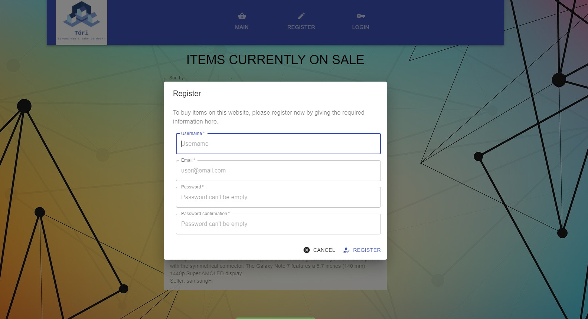

***Welcome to the home of your group's TIETA12, part 2 coursework code and documentation!***

This README.md file is where your group writes your project plan/project report.

When you write it, you must use Markdown. [Documentation for GitLab Flavored Markdown (GFM)](https://docs.gitlab.com/ee/user/markdown.html).

The directory structure of the code is up to your group to decide, but this README.md file must remain in place.


# Initial project plan document
The headers that must be present in this document are shown here. 

For instructions on what to add under these headers, see the course project assignment document, [see the coursework assignment document](https://docs.google.com/document/d/1ctG6mURrs1WlqwwPnMOFE_mSIEhZVCjp2XGefAZMdxQ/edit#heading=h.vsanic5plbto)

## Course project group information 

### Internal Server Error
Antti Pessa, 431566, antti.pessa@tuni.fi<br>
Henri Hakkarainen, 434896, henri.hakkarainen@tuni.fi<br>
Niki Väänänen, 428612, niki.vaananen@tuni.fi

Gitlab repo URL: https://course-gitlab.tuni.fi/tieta12-2019-2020/internal-server-error.git

## Installation (development and production separately)

### For development

Copy `.env.dist` in the root with the name `.env` (note the dot in the beginning of the file). This can be done on terminal with:

`$ cp -i .env.dist .env`

**Obs:** If `.env`-file already exists, do not overwrite it!

**Note:** Do not modify `.env.dist` file. It is a model to be copied as .env, it neither must not contain any sensitive data!

Also copy `.env.react` in the root with the name `.env` to directory frontend. This makes it that React complies automatically when changes are made to the React code on the local machine. You can use the following command:

`$ cp -i .env.react frontend/.env`

During development, its required to start two terminal windows. One is for starting the Express-server on port 3000 and the other is for starting the React build, which runs on port 3001. This helps in following the logs on the server side. After downloading this folder structure, first run the following command on your local machine:

`$ npm run setup`

 This script installs the required modules for each subdirectory. After that the following commands must be run inside Vagrant on their own terminal windows:

`$ npm run devserver` - starts the Express server (backend)

`$ npm run devapp` - starts the React application (frontend)

Now the React application UI can be viewed on http://localhost:3001.

Server is started with nodemon, so if any changes are made to the code, the server automatically restarts which makes the development and testing much easier. Also changes done to React application are immediately visible on the browser (might require page refresh).

<hr>

### For production

1. Install `nodejs` and `npm`, if not already installed.

2. Copy `.env.dist` in the root with the name `.env` (note the dot in the beginning of the file). This can be done on terminal with:

    `$ cp -i .env.dist .env`

    **Obs:** If `.env`-file already exists, do not overwrite it!

    **Note:** Do not modify `.env.dist` file. It is a model to be copied as .env, it neither must not contain any sensitive data!

3. Execute in the project root folder the following command:

    
    `$ npm run setup` - installs all the modules required for the application to run.
    
    `$ npm run build` - creates a production build of the React application

4. `Vagrantfile` is provided. It defines how the vagrant environment is set up, commands to be run:

    `$ vagrant up`    // sets up the environment<br>
    `$ vagrant ssh`   // moves a user inside vagrant
    
    Inside Vagrant navigate to the directory `/internal-server-error` and
start the app:

    `$ npm run app`

5. Open on browser: `http://localhost:3000` to view the application. Admin-users login credentials can be found on `.env` file.

## Planned functionality

### Implementation order
1. Backend 
- REST API
    - API endpoints
- MongoDB
    - User (Admin, Shopkeeper, Normal)
    - Item
    - Creditcard
2. Frontend 
- React
- Redux
3. Testing (If enough time)
- Mocha & Chai
- CI/CD pipeline

## Pages and navigation    

## Modules your group created in your Node project
```
├── backend
│   ├── app.js                  --> express app
│   ├── router.js               --> main router that setups other routes
│   ├── package.json            --> app info and dependencies
│   ├── config                  --> custom environment variables
│   ├── controllers             --> control the application behaviour
│   │   ├── item.js             --> functions for item handling
│   │   ├── payment.js          --> functions for payment handling
│   │   └── user.js             --> functions for user handling
│   ├── middleware              --> own middleware
│   │   └── auth.js             --> for authentication
│   ├── models                  --> models that reflect the db schemas
│   │   ├── creditcard.js       --> hold data about credit cards
│   │   ├── item.js             --> hold data about items
│   │   └── user.js             --> hold data about users
│   ├── routes                  --> a dir for router modules
│   │   ├── items.js            --> /items router
│   │   ├── payments.js         --> /payments router
│   │   └── users.js            --> /users router
│   ├── setup                   --> setup on startup
│   └── └── createusers.js      --> create admin user for the database
│
├── frontend
│   ├── src                     --> all react and redux files
│   │   ├── index.js            --> react app and store creation
│   │   ├── actions             --> redux action creators
│   │   ├── components          --> react presentational components
│   │   ├── containers          --> container components
│   │   ├── constants           --> redux constants
│   │   ├── reducers            --> redux reducers
│   │   └── store               --> redux store config
│   ├── public                  
│   └── package.json            --> app info and dependencies
│
├── documentation               --> pictures of the app
└── package.json                --> app info and dependencies

```
## Mongo database and Mongoose schemas
Models we're planning to use and their attributes and attribute types:
- User
    - Name (String)
    - Email (String)
    - Password (String)
    - Role (String) [admin/shopkeeper/normal]
    - CreditCard (Creditcard)
- Item
    - Name (String)
    - Owner (User)
    - Price (Number)
    - Description (String)
    - Onsale (Boolean)
- Creditcard
    - Number (String)
    - Balance (Number)
    - Owner (User)

The system holds information about the items that have been saved to the database and also about users that are buying or selling items. Item is saved the first time it is listed to being sold and a user is created the moment they register at the website.

User model contains a username, email and password. User model also has a role, which defaults to normal (registered) user so that the user is able to buy listed items and sell items to the shopkeepers on the webstore. User can be promoted to shopkeeper role (requires admin rights) and that role is able to sell items to all other customers (these offers are listed on the store for everyone). Admin users can edit basically anything.

Item model contains name of the item and the current owner of the item, which points to a user (each item on the database belong to some of the users). Item model also has attribute that holds information if the items is currently on sale or not (true/false). There is also an optional description field, where the item can be described with more detail. If the item is on sale, it also must have price attribute set (price must be >= 0).

Credit card / bank account information is modeled so that the Creditcard model contains number of the credit card and the balance of the card (how much money there is on the corresponding bank account). This model is being kept quite simple and straightforward on this imaginary webstore environment. On a real life application it would of course not be a good idea to keep track of a users bank account information and the payment would require authentication into a specific payment site.

If a user unregisters from the webstore (= user is deleted from database), all items that he/she owns are also removed from the database along with the credit card / bank account information of that user.

## API
Base API path: http://localhost:3000/api

API endpoints:
- GET-request
    - `/users` - list all users from the database
    - `/users/id` - get information about a specific user by id
    - `/items` - list all items from the database
    - `/items/id` - get information about a specific item by id
    - `/items/users/id` - list all items that belong to a specific user
    - `/items/users/id/offers` - list all items that belong to a specific user and are listed for sale
    - `/items/onsale` - list items that are owned by shopkeepers and are listed for sale
    - `/items/offers` - list items that are owned by normal users and are listed for sale
    - `/payments` - list all payment information from the database
    - `/payments/id` - get information about a specific credit card item by id
- POST-request
    - `/users` - creates a new user to database
    - `/items` - creates a new item to database
    - `/payments` - create a new credit card item to database
    - `/purchase` - item changes owner and money is transferred between credit cards
- PUT-request
    - `/users/id` - modify a specific user by id
    - `/users/id/role` - modify a specific user by id (including role - for admins only)
    - `/items/id` - modify a specific item by id
    - `/payments/id` - modify a specific credit card item by id
- DELETE-request
    - `/users/id` - delete a specific user from the database by id
    - `/items/id` - delete a specific item from the database by id
    - `/items/users/id` - delete all items that belong to a specific user
    - `/payments/id` - delete a specific creditcard item from the database by id

Payloads:
- POST-request (all of the listed attributes must be included)
    - `/users` - { username, email, password }
    - `/items` - { name, price, description, owner }
    - `/payments` - { number, owner }
    - `/purchase` - { sellerCCid, buyerCCid, itemId }
- PUT-request (one or more of the listed attributes may be included)
    - `/users/id` - { username, email, password, ccid } | *cc = credit card\**
    - `/users/id/role` - { username, email, password, role }
    - `/items/id` - { name, owner, description, onsale, price }
    - `/payments/id` - { balance }

## React and Redux

Implement using create-react-app. Inital plan is to start with getting the item listing page done first, then add login and purchase views. React and Redux should be done simultaneously. We will use https://material-ui.com/ for different components for the site: navigation, surfaces, sidebars, buttons etc.

We use Rails-style code structure which has separate folders for actions, constants, reducers, containers, store, and components. 
https://github.com/reduxjs/redux/blob/master/docs/faq/CodeStructure.md

## Testing 

~~We will move on to testing once all the backend and frontend work is done. Testing will be done using Chai and Mocha. React testing with Jest and React testing library.~~

We did not have enough time to do any unit testing during the coursework, this could be implemented later on if interest.

## Project timetable and division of work  

| Name   | Start  | End    | By who |
| ------ | ------ | ------ | ------ |
| Initial project plan          | 24.2. | 3.3.  | All    |
| Mongoose models               | 3.3.  | 6.3.  | Henri  |
| API paths and functionality   | 3.3.  | 10.3. | All    |
| Start on frontend             | 10.3  | 20.3  | All    |

## Our implementation

In this section we discuss how our marketplace functions. Below are listed multiple screenshots from the application where the main functionality can be viewed.

### Some notifications

In the assignment task there was mentioned that "admininstrator has the right to access / edit everything." However we decided to leave the credit card listing out of the administrators possibilities to have an influence on. So only users can access their own credit card information through their Account Information -page on the application. Administrator can edit everything else and create new users / items as they wish.

The application ideology is formed so, that when a user unregisters from the website (the account is deleted from the database) - all the items that are at that moment owned by that user are also removed from the database instead of left hanging around. The credit card information of the user is removed as well when the user unregisters.

About selling the items - it is possible for a user to list his/her own items for sale even if there are not credit card information added for the account. However, when those items are tried to be bought by other users, an alert is displayed that the purchasing of the items from the selected user is currently unavailable. Also there is an visible alert on the users Account information -page if that user has some items on sale but no active credit card information added - you do want the money for your bank account from the sales, right?

### Main page


This is our landing page, where all onsale items by shopkeepers are displayed. From this page the user can register or login with their account details. Items can be sorted by name or price in ascending or descending order.



Register view.


Login view.

### Normal user view


Once logged in, you can add new items or update owned items from the Sell items tab.


From the Account information tab the user can edit his information, add credits, add or delete credit card or unregister from the service.


User can change all his information.


If the user chooses to unregister all information will be deleted, including all the users items.

### Shopkeeper view


The shopkeeper has a Onsale tab, where he can buy items offered buy users. Shopkeeper can see the item name, price, description and the name of the user who is selling the item.


Once the shopkeeper clicks buy, he is confronted with a confirmation message that must be accepted before the transaction is complete.

### Admin view

#### User management


Logged in as admin, you can view all the users in the marketplace from the users tab.


Admin can update any users name, email, password or role. Admin can also delete any user.


Admin can create a new user. 

#### Item management


From the all items tab, the admin can view all the items in the marketplace. Admin can change the item sale state.


 The admin can update or delete the items.


The admin can also create a new item to the marketplace and assign it to any of the users.

## Future additions
Things we didn't have time for but would be awesome!
- Tests
- Ability to add pictures for a item or user
- Bidding feature

*Good luck and happy WWWdevvin’!*
